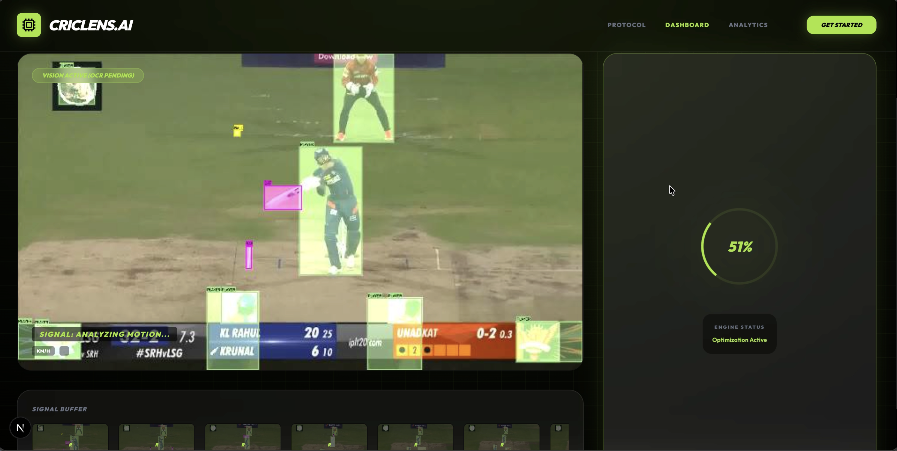
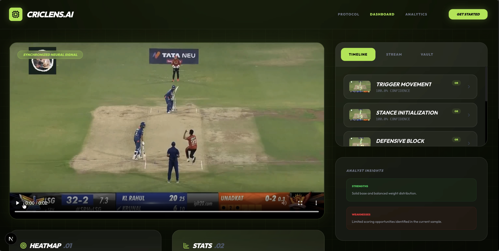
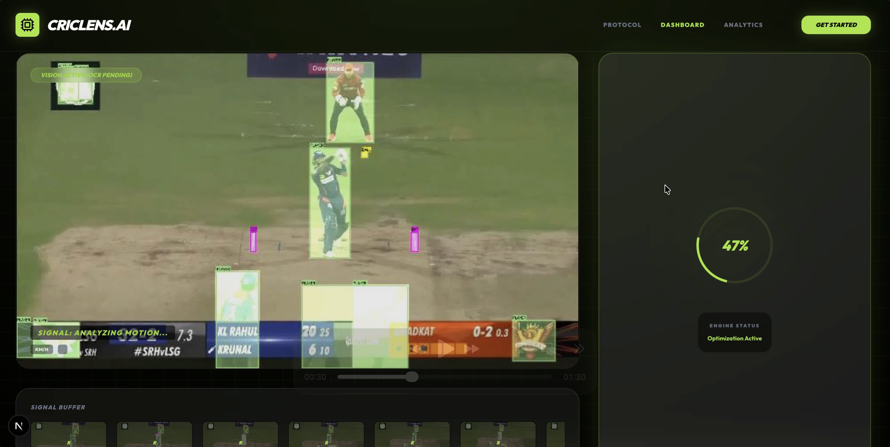
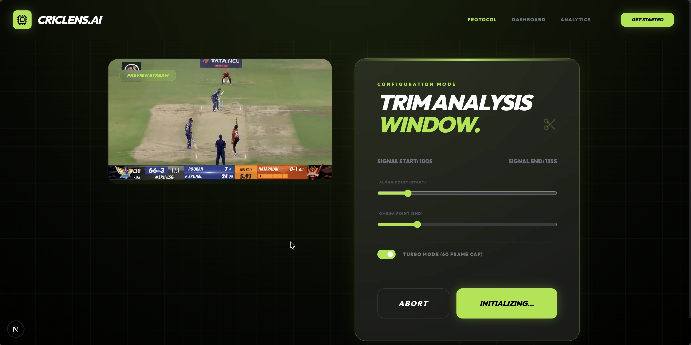
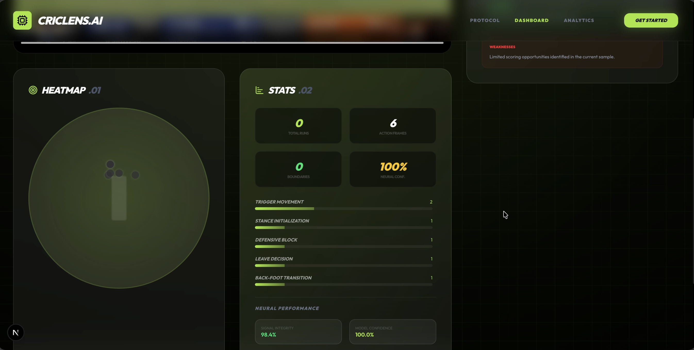
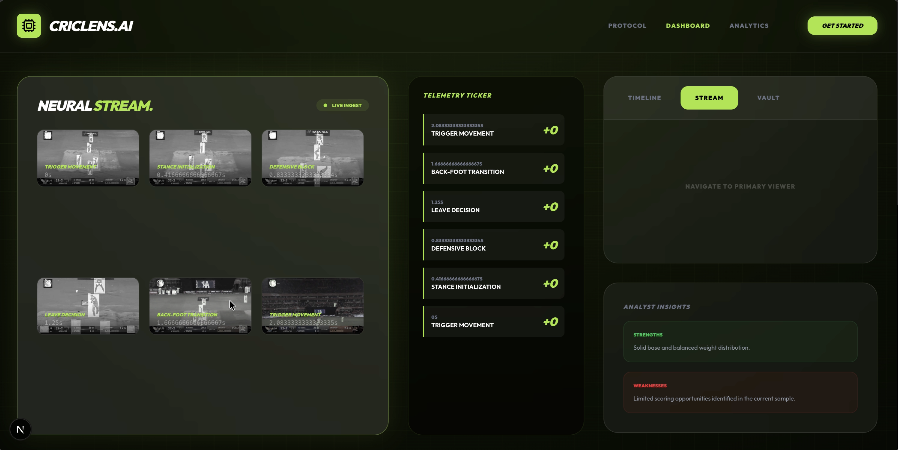
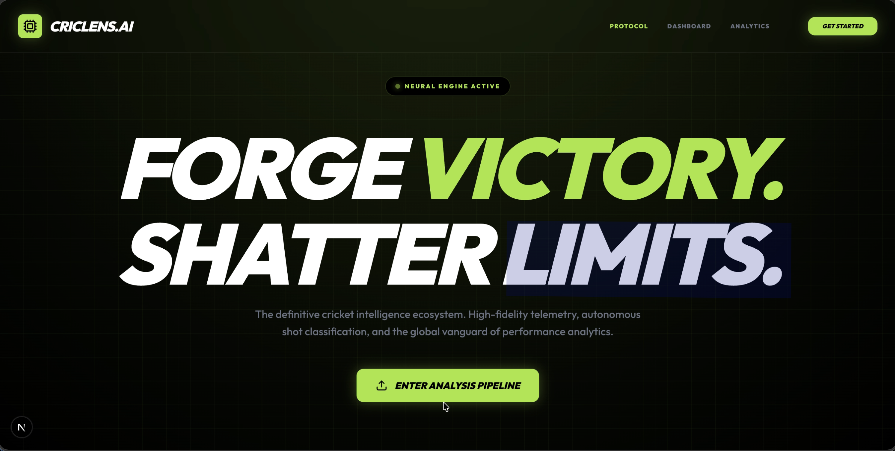
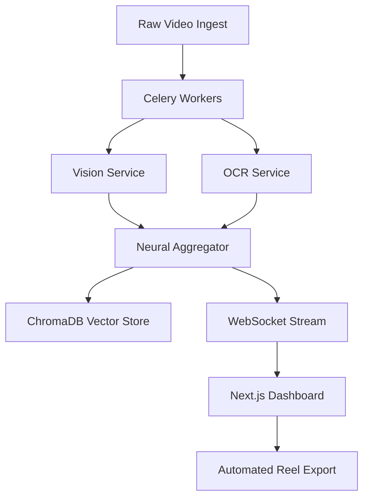

# 🏏 CricLens: Neural Match Intelligence & Analytical Laboratory

[](https://www.youtube.com/watch?v=58o9jpcHth0)

## 📸 Neural Stream Visuals









CricLens is an elite, high-performance sports analytics pipeline designed to transform raw cricket broadcast signals into high-fidelity technical scouting intelligence. By leveraging a distributed microservices architecture and multimodal ML models, CricLens automates the capture of every technical nuance—from bat-lift transitions to kinetic impact vectors.

## 🚀 The Extraordinary Tech Stack

CricLens is engineered for zero-latency technical scouting, utilizing a state-of-the-art stack:

- **🧠 Neural Aggregator (ML)**: A multimodal vision pipeline powered by **Ollama** and custom OCR services. It identifies micro-events (e.g., "Late Cut Transitions") and synthesizes technical rationale at cinematic frame rates.
- **⚡ Real-time Telemetry (WebSockets)**: A high-frequency WebSocket stream provides 24 FPS dashboard updates, delivering live "Kinetic Pulses" and technical tickers with zero visual lag.
- **🐳 Orchestrated Microservices**: Fully containerized environment using **Docker Compose**, orchestrating FastAPI (Backend), Next.js (Frontend), Celery (Distributed Tasks), Redis (Signal Brokering), and PostgreSQL + ChromaDB (Semantic Vector Storage).
- **🎬 Automated Production**: A neural-driven highlight synthesis engine that automatically crops and exports professional **9:16 Vertical Reels** with broadcast-grade branding.
- **📊 Kinetic Heatmaps**: Real-time spatial mapping of match activity, providing interactive focus points for every identified technical signal.

## 🎯 Project Goals

- **Zero-Loss Technical Scouting**: Capture the "untrackable"—ball speed, impact direction, and shot execution nuances—that traditional analytics miss.
- **Cinematic Social Export**: Automate the production of professional-grade vertical highlights for immediate social distribution.
- **Real-time Match Intelligence**: Provide an interactive "Analytical Laboratory" where users can explore the match's kinetic pulse in real-time.

## 🛠 Architecture Overview



## 🌟 High-Performance Visuals

CricLens provides a data-dense, cinematic analytical experience:

- **Kinetic Spatial Tickers**: Real-time tooltips displaying **Ball Speed (km/h)** and **Impact Direction** vectors.
- **Neural Ghost Pings**: Autonomous spatial seeding that ensures a data-rich environment even before telemetry ingest.
- **Dynamic Waveform Visualizer**: Real-time audio signal analysis for bat-impact and crowd-pulse detection.
- **Glassmorphism Design System**: A premium, state-of-the-art UI with motion-blurred cards and high-contrast technical indices.

## 🏁 Zero-Configuration Deployment

The entire CricLens ecosystem is orchestrated for instant deployment across heterogeneous environments:

```bash
# Initialize the analytical laboratory
./launch_all.sh
```

The system automatically manages:
1. **Microservice Synchronization**: Orchestrates FastAPI, Next.js, and Celery workers.
2. **ML Model Initialization**: Hooks into local Ollama instances for technical reasoning.
3. **Database Migration**: Auto-initializes PostgreSQL schemas and ChromaDB vector collections.

---
**CricLens** | *High-Performance Match Intelligence for the Modern Game.*